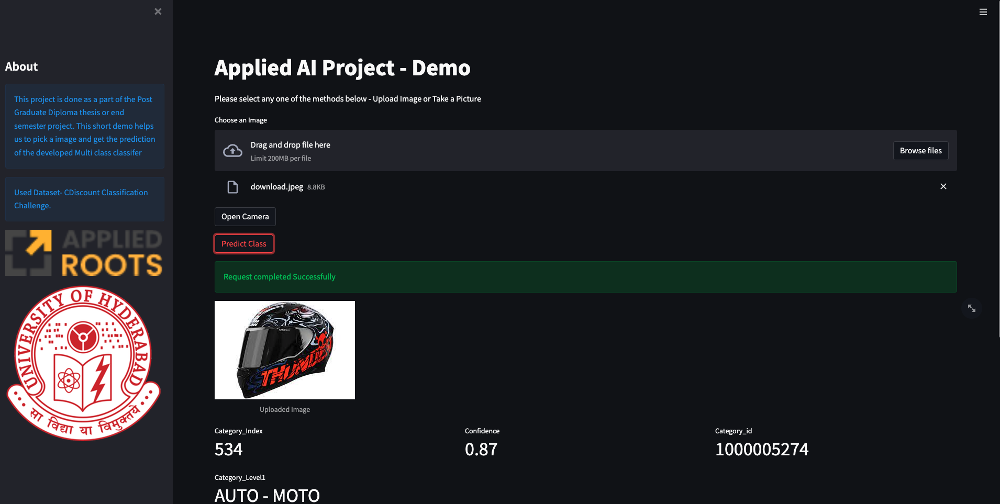

# CDiscount Challenge Code

## Applied Roots - University of Hyderabad
### PG Diploma Project

----

### Introduction:

CDiscount Challenge is France's largest non-food e-commerce company. The company sells everything from TVs to Trampolines and the list of products is rapidly growing. They have seen an increase from 10 million products to 30 million products in 2 years.

So Cdiscount applies ML algorithms to text descriptions of products in order to predict their category. As this method seems already close to the maximum potential, Cdiscount believes the next improvement would be classified with respect to Product Images.
This challenge is a part of Kaggle’s competition with prize money of 35000 USD for the best solution submission.

-------

### Code Explanation:

- The important components of the code especially the data processor and Model composer are in src. 

- The notebooks contains the Initial Data exploration and Modelling notebooks.

- The models contains the model weights.

- The DockerFiles help us to build Train and Deploy images.

- Model_api.py is responsible for running the model as a FastAPI service.

- web_app.py is responsible for running the Frontend using streamlit and FastAPI as a backend.

- train.py can be used for model training by setting the parameters in configs/config.py

- train.py requests wandb login to allow the logging of training metadata to your Wandb account.

- infer_class contains the inference - model load and predict method.

- model_converter can be used to juggle between different model formats - Still in updation to support multiple formats.

-----

### Launch train

- Set the parameters in configs/config.py and use the command below:
        
            python3 train.py

----
### Deploy the demo or the application

- Launch FastAPI after correcting the model path in model_api.py

            python3 model_api.py
    Change port no accordingly to get the response on a different port and change the same in the web_app.py

    A config file specification is in dev for deployment might be released soon.

- Launch Streamlit application using web_app.py. Use the below command

            streamlit run web_app.py

    Please change the port no according to your need.

    Open the Streamlit url usually http://<ip_address>:8501.

    You can then test the application.

---

### Demo Screen

    Streamlit Demo Page

